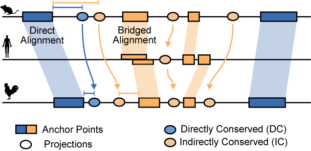

# IPP - Interspecies Point Projection

A tool for comparative genomics beyond direct sequence alignments

#### *Author*
- [Tobias Zehnder](https://github.com/tobiaszehnder)

#### *Citation*
If you are using IPP, please cite our [paper](https://www.nature.com/articles/s41588-025-02202-5)

---

## Introduction

### Method background

<figure>
  
  <figcaption> Mapping of orthologous regions between genomes using either direct (blue) or bridged (orange) projections with IPP. 
Direct = pairwise alignments between mouse (top) and chicken (bottom). 
Bridged = pairwise alignments between mouse and chicken to a ‘bridging species’ e.g. human (middle). 
</figcaption>
</figure>
<br><br>

For a genomic region with conserved synteny, any non-alignable coordinate can be approximately projected from one genome to another by linear interpolation of its relative position between two alignable anchor points.
The accuracy of such interpolations negatively correlates with the distance to the anchor points. Therefore, projections between species with large evolutionary distances (e.g. > 200 my) tend to be inaccurate due to a low anchor point density. Including so-called **bridging species** may increase the anchor point density and thus improve projection accuracy.
The optimal choice and combination of bridging species may vary from one genomic location to another. This presents a shortest path problem in a graph where every node is a species and the weighted edges between nodes represent distances of genomic locations to their anchor points (|x - a|). We established a scoring function that exponentially decreases with increasing distances |x - a|. The shortest path problem is solved using Dijkstra’s Shortest Path Algorithm (Dijkstra, 1959).

### Applications
Check out our [paper](https://www.nature.com/articles/s41588-025-02202-5) to see the applications of IPP being fully leveraged and validated as a viable strategy to uncover divergent sequences across distantly related species. This repository provides the source code and input files necessary to run IPP. 

IPP has also been previously applied [HERE](https://doi.org/10.1038%2Fs41588-022-01089-w) and [HERE](https://doi.org/10.1016/j.cell.2022.09.006)

---

## Installation

We now support reproducible environment management via [`uv`](https://github.com/astral-sh/uv), which is used for dependency resolution and virtual environment handling.

To install:

```bash
# Clone the repo
git clone https://github.com/tobiaszehnder/IPP.git
cd IPP

# Sync and activate the environment and build extension
make sync-build
```

This will automatically install all required Python packages and set up a virtual environment in `.venv`.

> Alternatively, you can install the required dependencies manually (not recommended):
> `pip install numpy pandas argparse tabulate tqdm pyranges`

---

## Quick start

To project any genomic regions of interest from one species to another, you'll need:

1. `regions.bed` — BED file of regions in the reference species
2. `.pwaln` file — a binary file with the pairwise alignments between reference, target, and bridging species

Example usage:

```bash
uv run python src/ipp/project.py -o ipp_output/ -n 10 ./enhancers.mm39.bed mm39 galGal6 ./mm39.galGal6.pwaln.bin
```

---


## Usage
Run `uv run python src/ipp/project.py -h` for a detailed description:

```
positional arguments:
  regions_file          Bed file containing genomic coordinates. regions with width > 1 will be centered.
  ref                   Reference species
  qry                   Query species
  path_pwaln

optional arguments:
  -h, --help            show this help message and exit
  -o OUT_DIR, --out_dir OUT_DIR
                        Directory for output files (default: ./ipp-data/)
  -sdc SCORE_DC, --score_DC SCORE_DC
                        Score threshold for direct conservation detection (default: 0.98)
  -sic SCORE_IC, --score_IC SCORE_IC
                        Score threshold for indirect conservation detection (default: 0.84)
  -ddc DISTANCE_DC, --distance_DC DISTANCE_DC
                        Distance threshold for direct conservation detection. Regions up to this distance to the closest anchor will be considered as directly conserved. Used instead of score_threshold.
                        (default: None)
  -dic DISTANCE_IC, --distance_IC DISTANCE_IC
                        Distance threshold for indirect conservation detection. Regions up to this distance to the closest anchor will be considered as indirectly conserved. Used instead of score_threshold.
                        (default: None)
  -dfc DISTANCE_FC, --distance_FC DISTANCE_FC
                        Distance threshold for functional conservation detection. Regions up to this distance to the closest region in the target_bedfile will be considered as functionally conserved.
                        (default: 500)
  -n N_CORES, --n_cores N_CORES
                        Number of CPUs (default: 1)
  -t TARGET_BEDFILE, --target_bedfile TARGET_BEDFILE
                        Functional regions in target species to check for overlap with projections for classification (default: None)
  -q, --quiet           Do not produce any log output (default: False)
  -v, --verbose         Produce additional debugging output (default: False)
  -c, --simple_coords   Make coord numbers in debug output as small as possible (default: False)
  -a, --include_anchors Include anchors in results table (default: False)
```

---

## Required Input

In addition to a `.bed` file containing genomic regions of interest from a reference species (e.g. mm39), the other required input for IPP is a `.pwaln` file, which is a binarized collection of pairwise alignments between the reference, target, and all bridging species.
We provide a set of precomputed `.pwaln` files for selected comparisons across vertebrate species. The set of bridging species used for these files are the same as those described in our [paper](https://www.nature.com/articles/s41588-025-02202-5). The provided collection includes files for comparisons where mouse (mm39), human(hg38) and chicken (galGal6) serve as the reference genomes. These large files are stored separately from github and can be downloaded [HERE](https://owww.molgen.mpg.de/~IPP/)

---

### Generate custom alignments
We provide a Snakemake pipeline to compute your own alignment collections for your choice of species. For that, run `compute_alignments/compute_pairwise_alignments.sh`. The script will guide you through the whole alignment process from fasta to chain files. 

#### Installing alignment pipeline dependencies

The alignment pipeline requires several external command-line tools that must be installed separately:

**Required tools:**
- **LAST alignment tools** (`lastal`, `lastdb`, `maf-convert`): Download from [LAST website](http://last.cbrc.jp/) or install via package manager
- **UCSC tools** (`axtChain`, `chainMergeSort`, `chainPreNet`, `faToTwoBit`, `twoBitInfo`): Download from [UCSC downloads](https://hgdownload.soe.ucsc.edu/admin/exe/) or install via package manager
- **GNU parallel** (provides `sem` command): Install via package manager
- **wget**: Usually pre-installed on Linux, install via package manager if needed

**Installation examples:**

- **macOS (Homebrew):**
  ```bash
  brew install parallel wget
  # LAST and UCSC tools are not available via Homebrew - install manually (see below)
  ```

- **Linux (apt):**
  ```bash
  sudo apt-get install last-align ucsc-tools parallel wget
  ```

- **Linux (yum/dnf):**
  ```bash
  sudo yum install last-align ucsc-tools parallel wget
  ```

- **Manual installation:**
  - **LAST**: Clone from GitLab and build from source:
    ```bash
    git clone https://gitlab.com/mcfrith/last.git
    cd last
    make
    # Add the 'bin' directory to your PATH or copy binaries
    export PATH="$PATH:$(pwd)/bin"
    # Or copy to system directory:
    # sudo cp bin/lastal bin/lastdb bin/maf-convert /usr/local/bin/
    ```
  - **UCSC tools**: Download from https://hgdownload.soe.ucsc.edu/admin/exe/ and add to PATH. On macOS, download the macOS-specific binaries:
    ```bash
    # Download UCSC tools for macOS
    wget https://hgdownload.soe.ucsc.edu/admin/exe/macOS.x86_64/axtChain
    wget https://hgdownload.soe.ucsc.edu/admin/exe/macOS.x86_64/chainMergeSort
    wget https://hgdownload.soe.ucsc.edu/admin/exe/macOS.x86_64/chainPreNet
    wget https://hgdownload.soe.ucsc.edu/admin/exe/macOS.x86_64/faToTwoBit
    wget https://hgdownload.soe.ucsc.edu/admin/exe/macOS.x86_64/twoBitInfo
    chmod +x axtChain chainMergeSort chainPreNet faToTwoBit twoBitInfo
    # Add to PATH or move to a directory in your PATH
    ```

Verify installation by running: `make test-alignments` (which checks for all required tools). 

In the output directory (defined by the `-d` flag), the pipeline will create a predefined folder structures to store relevant inputs like fasta files. The pipeline will try to look for genome fasta files from UCSC from the provided list of species (flag `-s`), but you can of course use your own **custom genomes**. In this case, store these fasta files under `<output_directory_name>/fasta`. 

```
Usage: compute_alignments/compute_pairwise_alignments.sh -s SPECIES -t TARGETS [optional: -d DATA_DIR -f FORCE -@ NTHREADS -n DRY_RUN]

required (one or the other):
  -s SPECIES      Comma-separated list or file (first column) with species (genome builds) for which to compute pairwise alignments
  -t TARGETS      Comma-separated list or file with target files (e.g. a list of chain files) to be produced

optional:
  -c CREATE_PWALN_COLLECTION		Flag for creating the pwaln collection file. Used as input for IPP
  -r REFERENCE		Reference species. Necessary for naming the collection file
  -q QUERY			Query species. Necessary for naming the collection file. If no query is provided, will generate for all non-reference species. 
  -d DATA_DIR   		Output directory. The script will create a predefined folder structure in that directory. (e.g. separate folders for alignment files, fasta files, etc.)
  -f FORCE			Force execution and overwriting existing files. Possible values: none (default) | space-separated rule names | all
  -@ NTHREADS     	Number of parallel threads
  -n DRY_RUN      	Flag for a dry run, i.e. only print the commands instead of executing
  -! SNAKEMAKE_ARGS		Optional arguments for Snakemake in quotes, i.e. -! "--debug-dag --unlock -p"
```

With these, you can create the final collection of pairwise alignments `.pwaln` between reference, target and a given set of bridging species that is used for running IPP. 
For example, to generate the required `.pwaln` file for a mouse-chicken comparison using our seletected bridging species (provided as a text file `species_ipp.txt') using 10 cores:

```bash
compute_alignments/compute_pairwise_alignments.sh -s ./species_ipp.txt -r mm39 -q galGal6 -c -d ./outdir -@ 10
```

Computing these large alignment files is time- and resource- consuming. We recommend running the pipeline on a large computing server with multi-core processing. 

## Output files
IPP takes the center bp of each input region to project them from the reference to the target genome. After projections for `./enhancers.mm39.bed` as an example from mm39 to galGal6, IPP returns 4 output files. These are:

1. `enhancers.mm39.mm39-galGal6.proj`. This is the main results containing all the relevant information about the projection, i.e. mapped coordinates in target genomes, projection score, classification of conservation based on set threshold, or which bridging species were used. More details of the fields are provided below:

| **id** | peak/region name from input BED4 |
|---|---|
| **coords_ref** | coordinates of projected bp from ref genome |
| **coords_direct** | coordinates of projected bp at target genome using direct alignment |
| **coords_multi** | coordinates of projected bp at target genome using bridged alignment |
| **score_direct** | projection score using direct alignment (0-1.0) |
| **score_multi** | projection score using bridged alignment (0-1.0) |
| **sequence_conservation** | sequence conservation classifcation (DC, IC, or NC) based on input thresholds (defined by -sdc, -sic, -ddc, -dic) |
| **functional_conservation** | classification of conserved activity in the target genome provided input functional data (e.g. ATAC-seq peaks) as + (overlapping/functionally conserved) or - (non-overlapping) |
| **bridging_species** | bridging species used |


- A portion of this output file can look like so:

| **id**      | **coords_ref** | **coords_direct** | **coords_multi** | **score_direct** | **score_multi** | **sequence_conservation** | **functional_conservation** | **bridging_species**  |
|-------------|----------------|-------------------|------------------|------------------|-----------------|---------------------------|-----------------------------|-----------------------|
| **peak_0**  | chr1:3262103   |                   | chr2:110998715   | 0                | 0.534             | NC                        |                             | susScr11,hg38,droNov1 |
| **peak_3**  | chr1:3741963   | chr2:110760891    | chr2:110760796   | 0.973              | 0.976             | IC                        |                             | hg38                  |
| **peak_2**  | chr1:3984056   | chr2:110692613    | chr2:110692900   | 0                | 0.643             | NC                        |                             | ornAna4               |
| **peak_9**  | chr1:4642083   | chr2:110488685    | chr2:110488706   | 0.993              | 1               | DC                        |                             | hg38                  |
| **peak_11** | chr1:4692857   | chr2:110468156    | chr2:110466809   | 0.715              | 0.947             | IC                        |                             | rn6                   |

- Optionally, details about anchor points will be additionally written to this `.proj` output file with the `-a` flag. Here, coordinates of the start/end anchor points to the left and right in the ref/target genomes using direct/bridged alignments are provided in dedicated fields.  

2. `enhancers.mm39.galGal6.bed`. a color-coded BED9 file containing the coordinates of projected regions in the target genome galGal6 with corresponding classifications

```
chr2    110998715       110998716       peak_0_chr1:3262103_NC  0.534   .       110998715       110998716       141,153,174
chr2    110760796       110760797       peak_3_chr1:3741963_IC  0.976   .       110760796       110760797       253,180,98
chr2    110692900       110692901       peak_2_chr1:3984056_NC  0.643   .       110692900       110692901       141,153,174
```

3. `enhancers.mm39.mm39.bed`. a color-coded BED9 file containing the coordinates of projected regions in the reference genome mm39 with corresponding classifications

```
chr1    3262103 3262104 peak_0_chr2:110998715_NC        0.534   .       3262103 3262104 141,153,174
chr1    3741963 3741964 peak_3_chr2:110760796_IC        0.976   .       3741963 3741964 253,180,98
chr1    3984056 3984057 peak_2_chr2:110692900_NC        0.643   .       3984056 3984057 141,153,174
```

4. `enhancers.mm39.mm39-galGal6.unmapped`. a list of regions where projections were not possible.


## License

This project is licensed under the [MIT License](LICENSE).

© 2025 Tobias Zehnder
